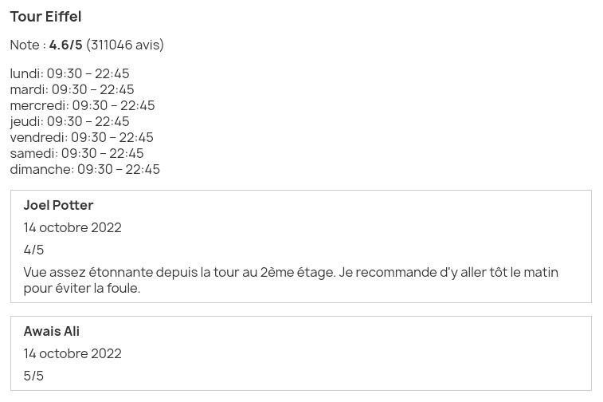

# Pixel GoogleMyBusiness

GoogleMyBusiness is a Prestashop module to import and display any Google place data on the frontend.



## Requirements

- Prestashop >= 1.7.6.0
- PHP >= 7.2.0

## Installation

Copy the `pixel_googlemybusiness` directory into the Prestashop `modules` directory.

## Configuration

From the module manager, find the module and click on configure.

| Field             | Description                                  | Example                          | Required |
|:------------------|:---------------------------------------------|----------------------------------|----------|
| Google API Key    | The Google Places API key.                   | D5MyLvpGOTI2GYXpisyJQCKw9ED3wdk7 | Y        |
| Google Place IDs  | Google place ids to import, one id per line. | ChIJLU7jZClu5kcR4PcOOO6p3I0      | Y        |

## Import

At the command prompt, go to the Prestashop root directory and  execute the following command:

```bash
./bin/console google_my_business:import_place {language}
```

- *language*: ISO 639-1 (en, de, fr...)

## Reviews

It is only possible to retrieve the last 5 reviews. Import often to accumulate the reviews.

## Display

In any template, add the following Widget:

```smarty
{widget name='pixel_googlemybusiness'}
```

Filter by place id with the `place_ids` widget param (comma separated):

```smarty
{widget name='pixel_googlemybusiness' place_ids='ChIJLU7jZClu5kcR4PcOOO6p3I0'}
```

**Note:** Only places imported in the current context language will be displayed

## Translations

In admin, go to the **Translations** page under the **International** menu.